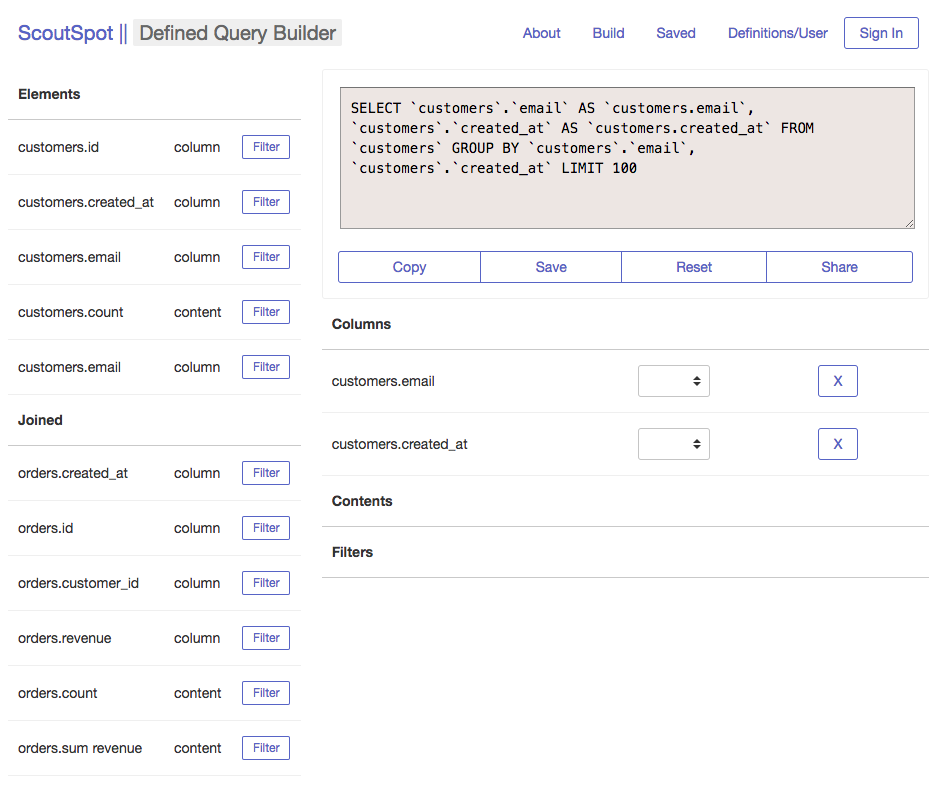

ScoutSpot
==============

A Defined SQL Query Builder

## What This Project is

* The app started as an Electron app, a breakoff from VLooker.
* After I came across some performance issues (it froze my Mac), I brought it over to NodeJS world, using an ExpressJS template
* The hosted demo version of this is hosted as a SPA but this can work if you download it as an ExpressJS app and run it.
* My goal is to have something that lets me define a bunch of columns and functions for future use. Then I can flexibly use those definitions for any sort of super complex SQL query in the future. This would be good for dealing with queries that have 1/ time issues 2/ calculations 3/ lots of formats that I would otherwise have to type up again and again for every little query.

## Project Structure

*Query Engine Structure*

* It is structured to have an Engine, which has within it an EngineQuery that contains the various components of the query
* The Engine interprets the data and then feeds it into the SQl library which provides the final sql query as a string

*React*
* The App started as pure JS, with underscore templating. I had a single page with a whole lot of functions tied with jQuery
* This is how Vlooker was built, and I thought that I would copy that over but that quickly became way untenable. I had this ridiculous list of JQuery functions in one 'app.js'
* I thought about using a Framework that I could use to render this complex UI onto the page.
* Came across learned React and added React to the page. I converted little by little the entire page into React components.
* By creating custom React classes, you can pass amazing things into the DOM, which is pretty cool. You can pre-render some things based on either the Props or State
* I started out with a lot of the content rendering via the standard way, setting an Initial State and having each individual component managing its own state.
* For example, for the Menu
* Later on I add other things like the React Router, which is pretty cool. It allows us to easily switch between the different parts of the app just like as if it had URLs

*App Structure*

Javascript, [app.js] <Wraps the app.jsx and renders it to the HTML dom element // I also bootstrap the Definitions file down here for Dev purposes>
> App ('app.jsx')
    - NavBar
    - HomeApp ('QueryApp/query_app.jsx') <The main home page>
    - QueryApp ('QueryApp/query_app.jsx') <The App page>
      - PanelCard <The Part that shows the Query>
      - Menu, which then holds >> [MenuRowTable || MenuRowElement] depending on what is being displayed
      - ElementTable, which then holds >> [ElementRow || FilterRow] depending on what the query is showing
    - SavedApp ('SavedApp/saved_app.jsx') <Page for looking at queries we have saved // pulled down from Firebase>
    - DefinitionsApp ('Definitions/sql_definitions.jsx') <A tree structure for viewing and managing the definitions JSON structure>

*Redux*

* But shortly after I found myself passing a whole lot of callbacks between the pages, passing four or five callbacks down into the component structure.
* This was annoying so I thought about a solution, and came across a page that talked about Flux. From Flux, I learned about Redux
* It took several days to convert the app to Redux and I am still getting the hang of it. Some of the Async stuff is sort of difficult.

## Features

- Create a SQL Query
- View Definitions
- Export a SQL Query in a URL string (It will rebuild the query depending on the URL)
- SQL features: Filters, Joins, Group Bys, Sum, Average, and some others

## To Do

- Actually editing and creating a new Definitions schema
- More capabilities with SQL functions
- Saving queries and running them against a database with saved credentials
- More visualizations
- Dashboards, someday?
